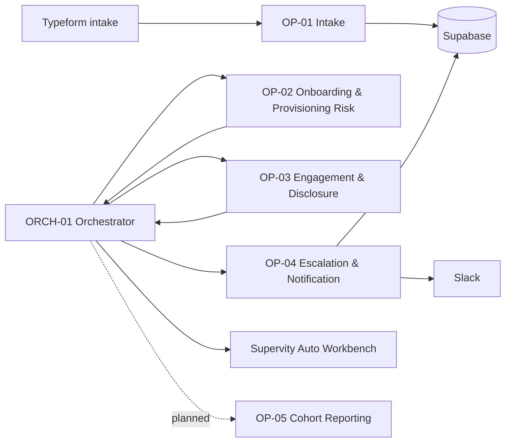

# Onboarding & Retention AI Employee

**Supervity Autopilot Asia Hackathon 2026 · HR & People Ops · Round 1**

A governed AI employee for monitoring a new hire's first 90 days, detecting onboarding and provisioning risks, handling sensitive engagement signals, and escalating ambiguous or high-risk cases to a human.

> [!IMPORTANT]
> **This is the supporting repository for the Round 1 build.** The primary AI employee, operator workflows, integrations, policies, execution logs, and human-review flow were built and run inside [Supervity Auto](https://auto.supervity.ai/). This repository contains the supporting configuration, data setup, local validation utilities, tests, and technical documentation. It is **not** a standalone reimplementation of the Supervity workspace.

The Round 1 build qualified for the hackathon's Grand Finale in Kuala Lumpur.

## What the system does

The system coordinates onboarding operations across HR, managers, and IT while keeping humans in control of judgment-heavy cases.

- Validates and normalizes new-hire intake.
- Detects stalled onboarding tasks and delayed IT provisioning.
- Flags low-engagement signals and sensitive disclosures.
- Routes manager nudges, IT escalations, and confidential HR alerts.
- Sends ambiguous or exceptional cases to Supervity Auto Workbench instead of guessing.
- Records policy-driven decisions and outcomes for auditability.

## Where the actual automation lives

| Layer | Implementation |
|---|---|
| AI employee runtime | Supervity Auto |
| Orchestration and operator logic | Supervity Auto operators / jobs |
| Human review | Supervity Auto Workbench |
| System of record | Supabase |
| Notifications | Slack |
| Intake | Typeform |
| Local support code | This repository |

The repository exists mainly to make the Round 1 build easier to seed, test, explain, and reproduce around the platform workflow.

## Architecture



### Operators

| Component | Responsibility |
|---|---|
| `OP-01` | Validate, normalize, and deduplicate new-hire intake |
| `OP-02` | Detect onboarding-task and provisioning risks |
| `OP-03` | Detect engagement risk and sensitive disclosures |
| `OP-04` | Route notifications, escalations, and audit writes |
| `OP-05` | Planned cohort-level reporting layer; documented but descoped from the final Round 1 live path |
| `ORCH-01` | Coordinate operators, branching, policy checks, and exceptions |

The Round 1 live path centered on `OP-01` through `OP-04` plus `ORCH-01`; `OP-05` remained a documented extension rather than part of the final live demo. Detailed design notes are available in [`docs/`](docs/).

## Repository structure

```text
.
├── .github/workflows/tests.yml     # CI for the local Python validation suite
├── config/
│   ├── policy_config.json          # Public-safe reference policy configuration
│   ├── supabase_schema.sql         # Supabase schema used by the support tooling
│   └── README.md                   # Policy/config notes
├── dataset/
│   ├── hr_enterprise_export.xlsx   # Round 1 sample scenario data
│   └── csv/                        # CSV exports consumed by the loader/tests
├── docs/                           # Architecture, operators, decisions, risks, demo notes
├── scripts/seed_loader/            # Local normalization, validation, and Supabase seeding tools
├── CONTEXT.md                      # Detailed Round 1 context and scenario notes
├── .env.example                    # Environment variable template, no real credentials
└── README.md
```

## Local setup

The local code is optional. It supports the platform build by validating and reseeding the Round 1 dataset.

```bash
python -m venv .venv

# macOS / Linux
source .venv/bin/activate

# Windows PowerShell
# .venv\Scripts\Activate.ps1

pip install -r scripts/seed_loader/requirements.txt
cp .env.example .env
```

For a safe local validation that does not write to Supabase:

```bash
python scripts/seed_loader/loader.py --dry-run
```

To seed a configured Supabase project, set `SUPABASE_URL` and `SUPABASE_SERVICE_ROLE_KEY` in `.env`, then run:

```bash
python scripts/seed_loader/loader.py
```

## Tests

```bash
cd scripts/seed_loader
python -m unittest discover -v
```

The cleaned repository passes **58 unit tests**, covering schema validation, date normalization, numeric coercion, fuzzy deduplication, duplicate handling, and the sample dataset.

## Design principles

1. **Escalate instead of inventing data.** Missing, ambiguous, or unsafe cases should reach human review.
2. **Keep sensitive disclosures isolated.** Confidential content must not leak into general notifications or cohort reporting.
3. **Keep thresholds configurable.** Operational rules live in policy configuration instead of being scattered through workflow logic.
4. **Treat local code as support tooling.** The Supervity Auto workspace remains the source of truth for the actual Round 1 automation.

## Documentation

For deeper implementation context:

- [`docs/ARCHITECTURE.md`](docs/ARCHITECTURE.md) — system design and component boundaries
- [`docs/OPERATORS.md`](docs/OPERATORS.md) — operator behavior and contracts
- [`docs/DATA_FLOW.md`](docs/DATA_FLOW.md) — data lifecycle and confidentiality rules
- [`docs/INTEGRATIONS.md`](docs/INTEGRATIONS.md) — Supabase, Slack, Typeform, and Auto integration notes
- [`docs/DECISIONS.md`](docs/DECISIONS.md) — architecture decision records
- [`docs/RISKS.md`](docs/RISKS.md) — known risks and mitigations
- [`docs/AUTO_BUILD_GUIDE.md`](docs/AUTO_BUILD_GUIDE.md) — Round 1 workspace build notes
- [`docs/DEMO.md`](docs/DEMO.md) — demo and validation notes

## Security

Real credentials are intentionally excluded from this repository. Do not commit `.env`, service-role keys, Slack tokens, webhook secrets, or workspace-specific credentials. The checked-in routing identifiers are placeholders only.

## Event

Built for the **Supervity Autopilot Asia Hackathon 2026**, Track 05: **HR & People Ops**.

- Hackathon: <https://www.supervity.ai/autopilot-asia-hackathon-malaysia>
- Supervity Auto: <https://auto.supervity.ai/>
